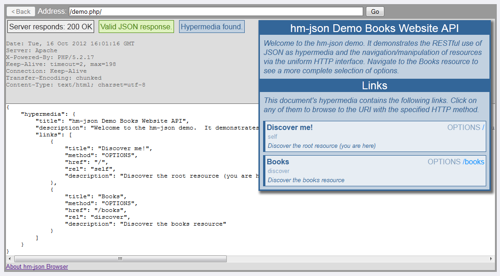

# hm-json-browser
A REST hypermedia JSON (hm-json) API browser that runs in your browser!

Imagine being able to navigate/explore and USE a JSON-based API just like you would any HTML website.
The `hm-json` hypermedia format allows exactly this and *hm-json browser* understands that format the
same way your Web browser understands HTML forms and links.

See also the companion PHP server-side library: https://github.com/ratfactor/HummingJay
